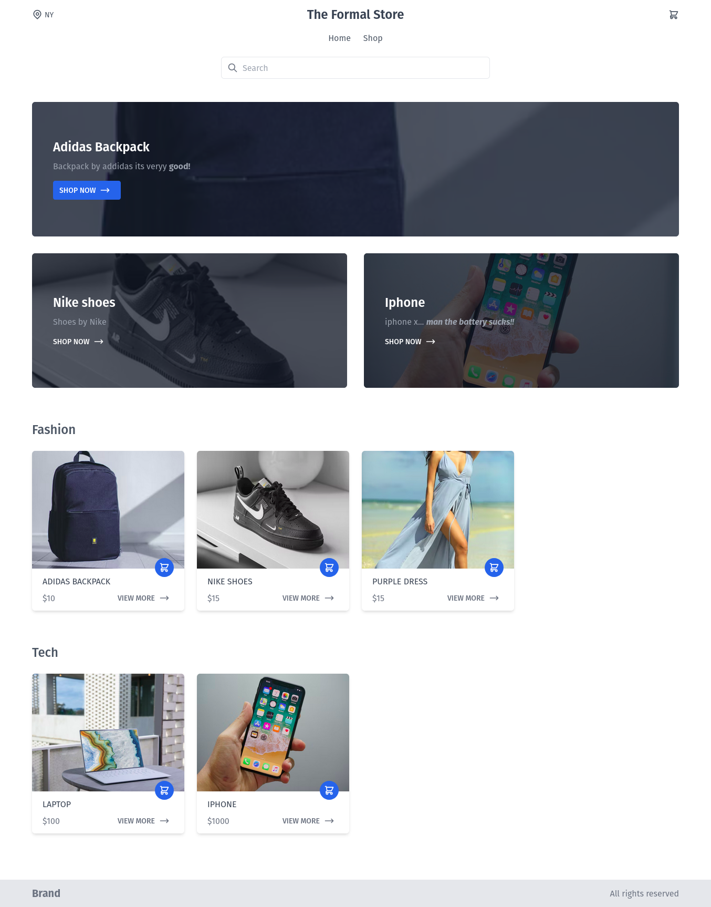
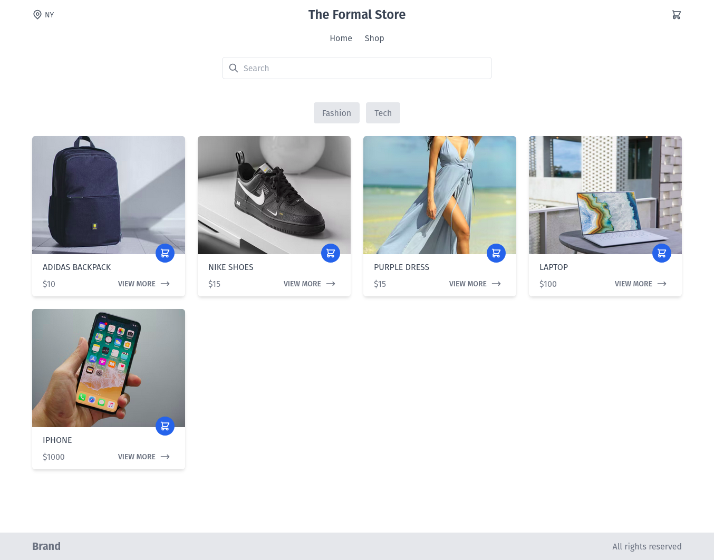
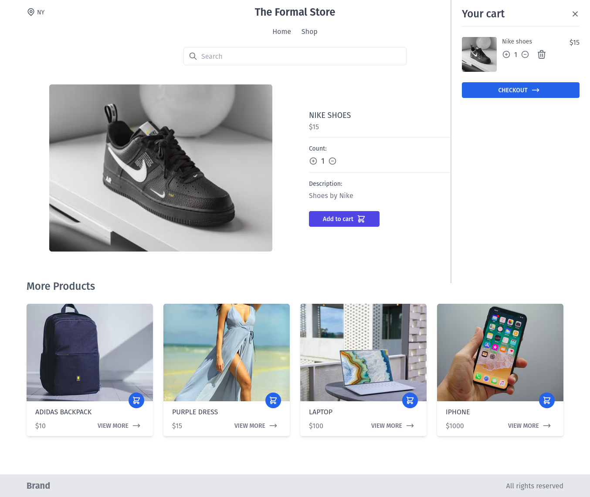
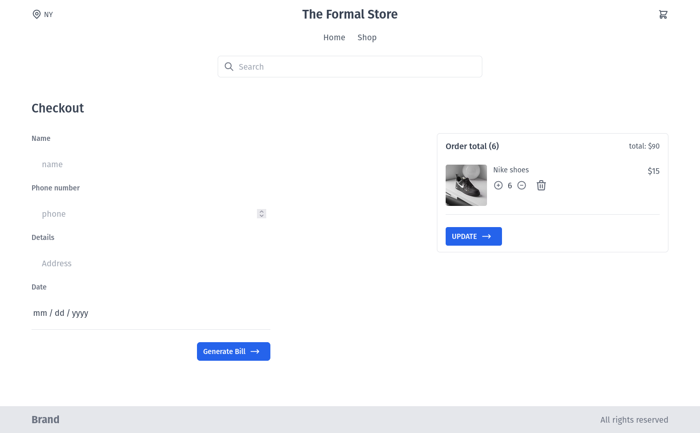
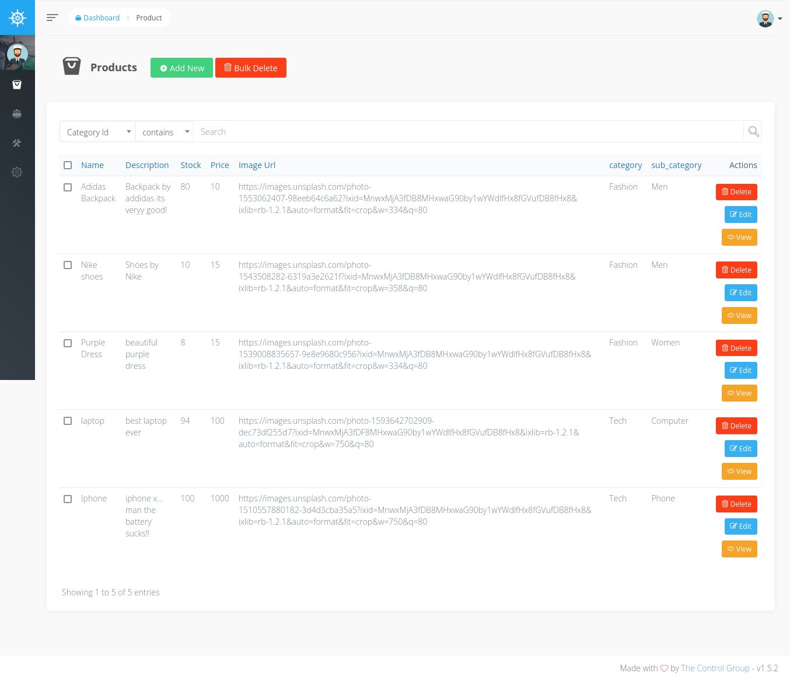
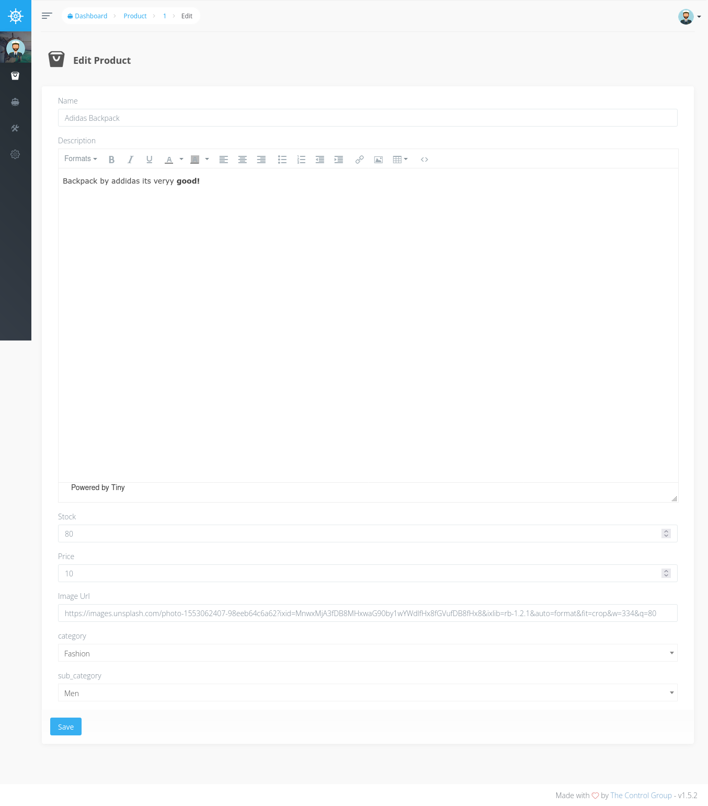
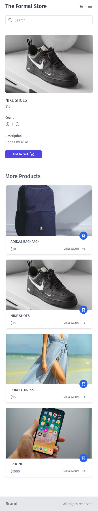

<p align="center"><a href="https://laravel.com" target="_blank"></a></p>

<p align="center">
<a href="https://travis-ci.org/laravel/framework"></a>
<a href="https://packagist.org/packages/laravel/framework"></a>
<a href="https://packagist.org/packages/laravel/framework"></a>
<a href="https://packagist.org/packages/laravel/framework"></a>
</p>

## Stack info

The project is build with [laravel](https://laravel.com/), [tailwind](https://tailwindcss.com/), [alpine js](https://alpinejs.dev/) and [voyager](https://voyager.devdojo.com/) as a admin panel package for the models defined in laravel.

### Start the project

-   clone the repo

```bash
git clone https://github.com/arjansunar/root-level-next-deploy.git
```

-   change the directory

```bash
 cd root-level-next-deploy
```

-   download dependencies and **configure the .env file**

```bash
composer install
composer update
```

-   run

```bash
php artisian serve
```

## Ecommerce app

-   ### Home page

    

-   ### Shop page
    
-   ### Product info

    

-   ### Checkout page

    

-   ### Voyager product page

    

-   ### Voyager editing products
    

### Mobile version


